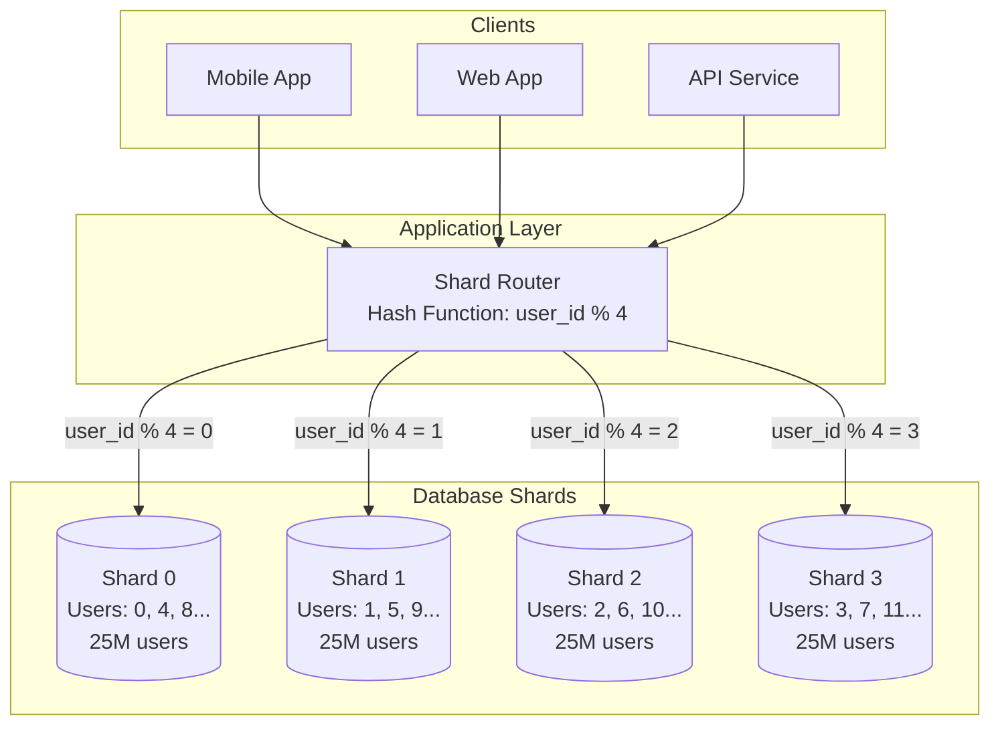
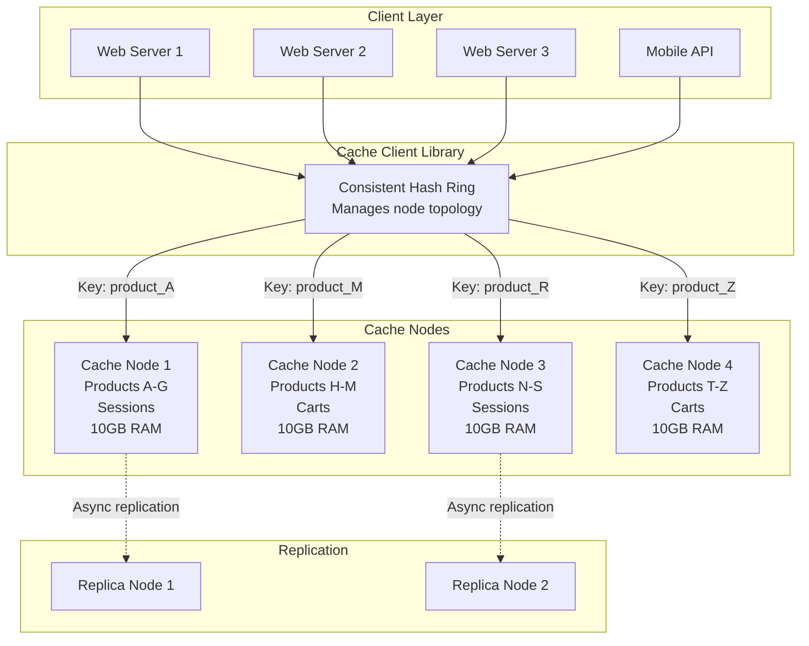
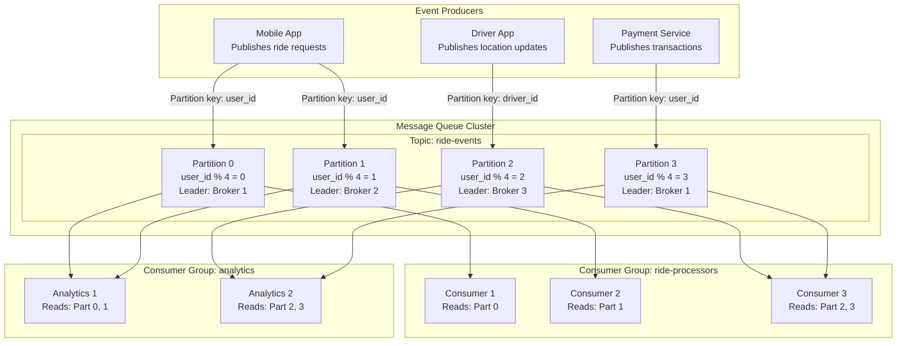

# Partitioning and Sharing in System Design

## Overview

**Partitioning** (also called **Sharding**) is the practice of dividing data across multiple nodes/servers to achieve horizontal scalability. **Sharing** refers to how multiple clients or services access and utilize these partitioned resources.

This document explores 3 real-world use cases demonstrating different partitioning and sharing strategies.

---

## Use Case 1: Database Sharding for User Data

### Scenario
A social media platform with 100 million users needs to scale its user profile database. A single database server cannot handle the read/write load and storage requirements.

### Partitioning Strategy: Hash-based Sharding by User ID



### Key Concepts

**Partitioning:**
- Data is divided using hash function: `shard = user_id % 4`
- Each shard holds ~25M users
- User data is stored on exactly one shard (no duplication)
- Even distribution of data across shards

**Sharing:**
- All clients share access to the same logical database
- Shard router directs requests to the correct physical shard
- Clients are unaware of the partitioning scheme
- Read/write operations distributed across all shards

### Advantages
✓ Horizontal scalability (add more shards as users grow)
✓ Parallel query execution across shards
✓ Isolation of failures (one shard down doesn't affect others)
✓ Even load distribution

### Challenges
✗ Cross-shard queries are expensive (e.g., "find all users named John")
✗ Rebalancing data when adding/removing shards
✗ Maintaining referential integrity across shards

### Example Query Flow

```
1. Request: Get user profile for user_id = 12345
2. Router calculates: 12345 % 4 = 1
3. Router forwards request to Shard 1
4. Shard 1 returns user profile
5. Response sent back to client
```

---

## Use Case 2: Distributed Cache with Consistent Hashing

### Scenario
An e-commerce platform needs to cache product information, user sessions, and shopping carts. The cache must handle 1 million requests/second with minimal latency and gracefully handle node failures.

### Partitioning Strategy: Consistent Hashing



### Visual: Consistent Hash Ring

```
         0° (Node 1)
            |
      270°  +  90° (Node 2)
            |
        180° (Node 3)

Keys are hashed to points on the ring:
- "product:12345" → 45° → Stored on Node 2
- "session:abc" → 200° → Stored on Node 3
- "cart:xyz" → 315° → Stored on Node 1

When Node 2 fails:
- Keys from 90°-180° move to Node 3
- Only 1/4 of data needs to be remapped
```

### Key Concepts

**Partitioning:**
- Each cache key is hashed to a position on a virtual ring (0-360°)
- Cache nodes are placed at specific positions on the ring
- A key is stored on the first node encountered clockwise from its position
- Virtual nodes (multiple positions per physical node) ensure better distribution

**Sharing:**
- Multiple application servers share the same cache cluster
- Client library maintains the hash ring topology
- Automatic failover: if a node fails, its keys move to the next node
- Write-through or write-behind patterns for data consistency

### Advantages
✓ Minimal data movement when nodes are added/removed (only 1/N keys affected)
✓ Fault tolerant with automatic failover
✓ Distributed load across all nodes
✓ Client-side routing (no single point of failure)

### Challenges
✗ Cache coherence across replicas
✗ Thundering herd problem when cache expires
✗ Memory pressure on nodes after failures

### Example: Handling Node Failure

```
Initial state: 4 nodes, each handles 25% of keys

Node 2 fails:
1. Client detects failure (timeout/health check)
2. Client library updates hash ring (removes Node 2)
3. Keys previously on Node 2 now map to Node 3
4. Cache misses increase for those keys
5. Data gradually repopulates on Node 3
6. Optional: Promote replica to primary

Result: Only 25% of keys affected, 75% continue working
```

---

## Use Case 3: Message Queue Partitioning (Kafka-style)

### Scenario
A ride-sharing app needs to process real-time events: ride requests, driver location updates, payment transactions. The system must handle 100K events/second while maintaining event ordering per user/driver and enabling parallel processing.

### Partitioning Strategy: Topic Partitions with Consumer Groups



### Partition Assignment Visualization

```
Topic: ride-events (4 partitions)

Partition 0: [user_1, user_5, user_9, user_13...]  ← Consumer 1
Partition 1: [user_2, user_6, user_10, user_14...] ← Consumer 2
Partition 2: [user_3, user_7, user_11, user_15...] ← Consumer 3
Partition 3: [user_4, user_8, user_12, user_16...] ← Consumer 3

Each partition maintains strict ordering:
Part 0: [Event1(user_1), Event2(user_1), Event3(user_5)...]
        Offset: 0         1                2
```

### Key Concepts

**Partitioning:**
- Topic is divided into multiple ordered partitions
- Messages with same partition key go to same partition
- Each partition is an ordered, immutable log
- Partitions can be replicated across brokers for fault tolerance

**Sharing:**
- Multiple consumer groups can read the same topic independently
- Within a consumer group, each partition is assigned to exactly one consumer
- Enables both parallel processing and multiple independent workloads
- Each consumer group maintains its own offset (read position)

### Advantages
✓ Parallel processing (scale by adding consumers)
✓ Ordering guarantee per partition key (e.g., all events for user_123 are ordered)
✓ Multiple consumer groups enable different use cases (processing + analytics)
✓ Replay capability (consumers can rewind to any offset)
✓ High throughput (distributed writes and reads)

### Challenges
✗ Number of partitions is typically fixed at topic creation
✗ Hot partitions if keys are not evenly distributed
✗ Consumer rebalancing when adding/removing consumers
✗ No ordering across partitions

### Example: Event Processing Flow

```
Event: User 12345 requests a ride

1. Producer publishes:
   {
     "user_id": 12345,
     "event": "ride_requested",
     "timestamp": "2025-11-17T10:00:00Z"
   }
   Partition key: user_id

2. Partition calculation:
   partition = hash(12345) % 4 = 1

3. Message written to Partition 1:
   - Appended to end of log
   - Assigned offset: 45023
   - Replicated to 2 replica brokers

4. Consumer 2 reads from Partition 1:
   - Fetches messages starting from offset 45020
   - Processes event
   - Commits offset 45023

5. Analytics Consumer Group:
   - Analytics 1 independently reads same message
   - Uses for real-time dashboards
   - Maintains separate offset
```

### Rebalancing Scenario

```
Initial: 4 partitions, 3 consumers
- Consumer 1: Partition 0
- Consumer 2: Partition 1
- Consumer 3: Partitions 2, 3

Consumer 4 joins:
1. Consumer group coordinator triggers rebalance
2. All consumers stop processing
3. Partitions reassigned:
   - Consumer 1: Partition 0
   - Consumer 2: Partition 1
   - Consumer 3: Partition 2
   - Consumer 4: Partition 3
4. Consumers resume from last committed offset
5. Processing distributed more evenly

Result: Better throughput, lower latency per consumer
```

---

## Comparison Matrix

| Aspect | Database Sharding | Distributed Cache | Message Queue |
|--------|------------------|-------------------|---------------|
| **Partitioning Method** | Hash-based | Consistent Hashing | Topic Partitions |
| **Primary Goal** | Scale storage & writes | Low latency reads | Event streaming & ordering |
| **Data Distribution** | Even distribution | Minimal redistribution on changes | Key-based ordering |
| **Consistency Model** | Strong (per shard) | Eventual | Eventual (ordered per partition) |
| **Sharing Pattern** | Shared-nothing | Shared cache with local clients | Shared topic, partitioned consumption |
| **Typical Use Case** | User profiles, transactional data | Sessions, product catalog | Events, logs, real-time data |
| **Failure Handling** | Failover to replica | Consistent hashing redistribution | Consumer rebalancing |

---

## Best Practices

### Choosing a Partitioning Strategy

1. **Hash Partitioning**: Use when you need even distribution and mostly single-record access
   - Example: User profiles, product catalog

2. **Range Partitioning**: Use when you frequently query ranges of data
   - Example: Time-series data, logs by date

3. **Consistent Hashing**: Use when nodes frequently join/leave the cluster
   - Example: Distributed caches, CDN

4. **Key-based Partitioning**: Use when ordering matters within a key
   - Example: Event streams, activity feeds

### Sharing Considerations

- **Access Patterns**: Design partitions based on how data is accessed
- **Hotspots**: Monitor for uneven load; use composite keys if needed
- **Cross-partition Operations**: Minimize joins/aggregations across partitions
- **Monitoring**: Track partition sizes, request distribution, and rebalancing events

---

## Conclusion

Partitioning and sharing are fundamental to building scalable distributed systems. Each use case demonstrates different trade-offs:

- **Database Sharding**: Optimizes for transactional consistency and storage scalability
- **Distributed Cache**: Optimizes for read latency and graceful degradation
- **Message Queue**: Optimizes for throughput, ordering, and parallel processing

Choose the strategy that aligns with your system's primary bottleneck and access patterns.
